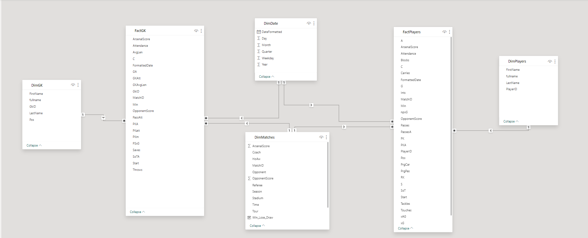
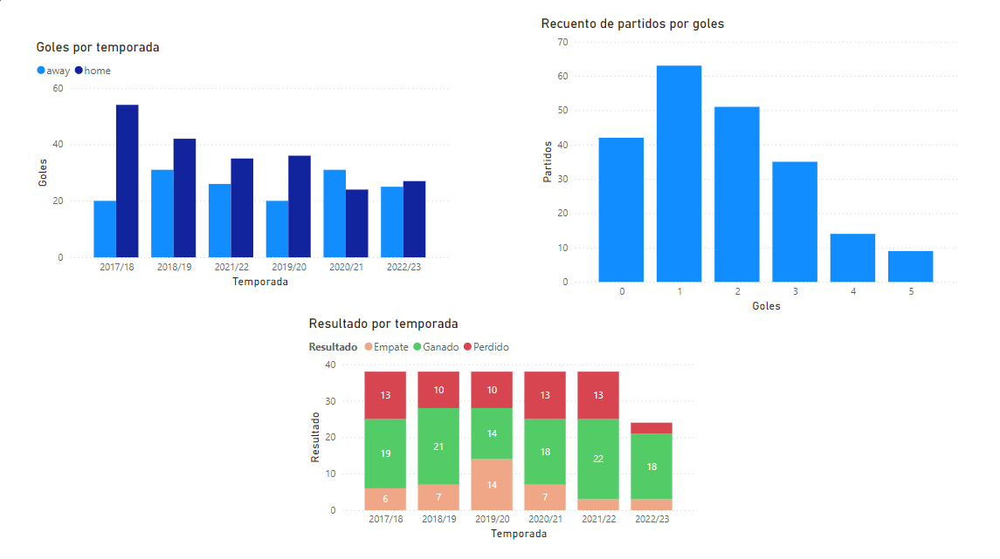
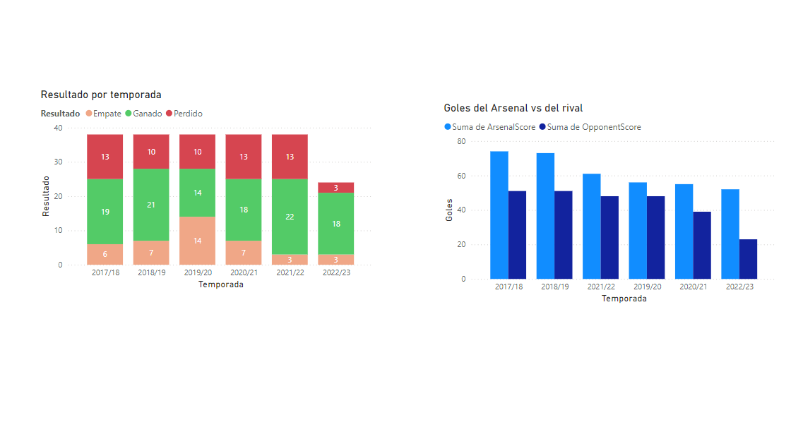
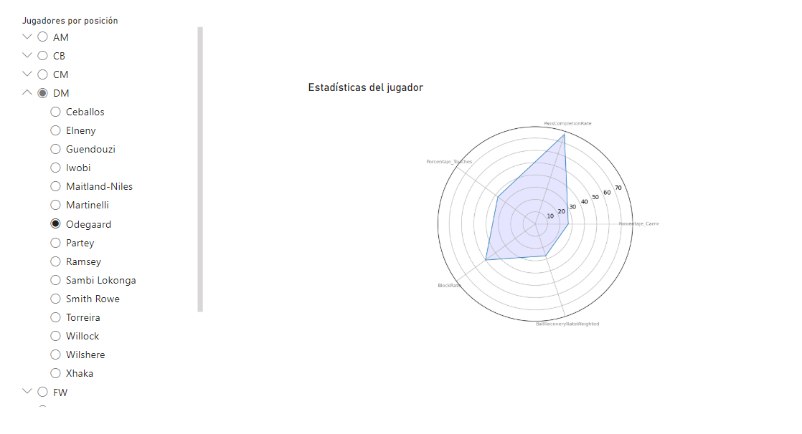
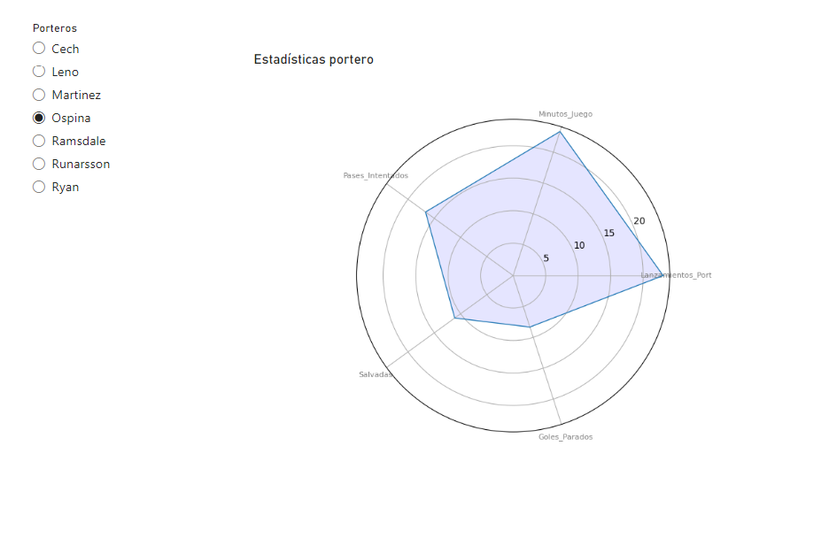
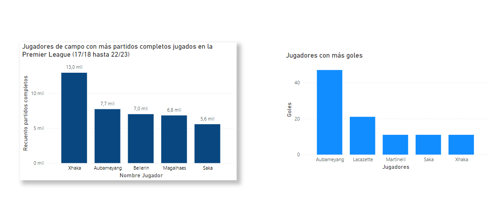
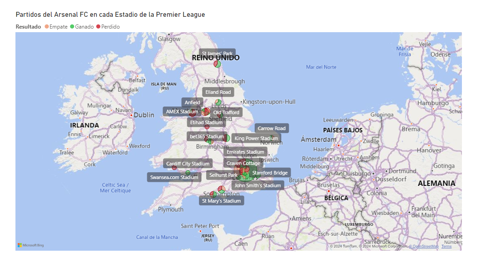
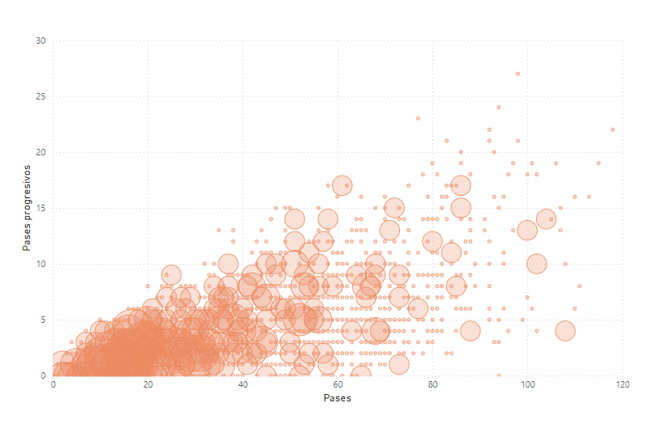

# Canalización de Datos - Caso Práctico (Arsenal FC)

Proyecto basado en : [Building a football data pipeline a walkthrough of the Arsenal FC data en engineering project](https://medium.com/@muhamedfahmy7474/building-a-football-data-pipeline-a-walkthrough-of-the-arsenal-fc-data-engineering-project-4383cd247192)

**Repositorio original del autor:**
``` 
git clone https://github.com/Muhammadatef/ArsenalFC-Data-Pipeline-Project
```

En este proyecto de canalización de datos del equpo de fútbol Arsenal FC donde se llevará a cabo una práctica en la que aprenderemos habilidades esenciales de ingeniería de datos.

La configuración de canalización de divirá en las siguientes fases:

### Fases

1. [Capa de Extracción](#1-capa-de-extración)
2. [Capa de Transformación](#2-capa-de-transformación)
3. [Carga de datos en el Data Warehouse](#3-carga-de-datos-en-el-data-warehouse)
4. [Orquestación con Apache Airflow](#4-orquestación-con-apache-airflow)  
5. [Visualización e Insights con PowerBI](#5-visualización-e-insights-con-power-bi)

### Tecnologías y Herramientas

- **Infrastructure:** Docker
- **Almacenamiento de datos (Data Warehouse)**: PostgreSQL
- **Base de datos**: PostgreSQL
- **Orquestación**: Apache Airflow
- **Procesamiento de datos**: Apache Spark
- **Scripts para proceso de integración de datos(ETL):** Jupyter & Python
- **Capa de servicio**: PowerBI

#### Arquitectura de Canalización


- **Ingesta:** Se ingestan datos en bruto a partir de archivos CSV que contienen datos como resultados de partidos, estadísticas de jugadores y otros datos relacionados.

- **Proceso ETL:** Utilizaremos `Apache Spark` para el proceso ETL, extraer datos de diferentes fuentes, transformarlos (hacerles cambios o limpiarlos) y luego cargarlos a una base de datos, como PostgreSQL (una base de datos donde podemos almacenar los datos).
Para organizar y programar las tareas usaremos `Airflow`
- **Almacenamiento de datos:** Usaremos `PostgreSQL` para el almacenamiento estructurado de datos transformados.
- **Servicio de datos:** para la visualización de los datos usaremos `PowerBI` con la que podemos presentar información detallada a través de cuadros de mando interactivos.

## Guía paso a paso para configurar el proyecto

### Requisitos

Necesitaremos tener instalado:

- [Docker](https://www.docker.com/)
- [Docker Compose](https://docs.docker.com/compose/install/)


### Instalación y configuración

[Video tutorial siguiendo la guía paso a paso](https://tajamar365-my.sharepoint.com/:v:/p/tsuenkit_lui/EVaC30vPIJBOkAT42DYw0a0BMUKasSDAN9SaH3N2QulmTw?nav=eyJyZWZlcnJhbEluZm8iOnsicmVmZXJyYWxBcHAiOiJPbmVEcml2ZUZvckJ1c2luZXNzIiwicmVmZXJyYWxBcHBQbGF0Zm9ybSI6IldlYiIsInJlZmVycmFsTW9kZSI6InZpZXciLCJyZWZlcnJhbFZpZXciOiJNeUZpbGVzTGlua0NvcHkifX0&e=be0MGb)

#### 1. Clonar el repositorio de GitHub.

```bash
git clone https://github.com/TsuenKitTajamar/docker-spark-postgresql-powerbi.git
```

#### 2. Cambiarse al directorio del proyecto
```bash
cd ArsenalFC-Data-Pipeline-Project/
```

#### 3. Ejecutar el siguiente comando de Docker Compose para configurar el entorno.

**Iniciamos Docker Desktop**

Ahora inicia y ejecuta el contenedor:

```bash
docker-compose up -d
```

Notas: Si nos da un debido a que ya existe la imagen, ejecutaremos el siguiente comando:

```bash
docker system prune -af
```

#### 4. Acceder a Jupyter Notebook

Abrimos Jupyter en nuestro navegador para ejecutar los scripts ETL. 
```
http://localhost:8085/
```


Para acceder nos pedirá un`token` para ello accedemos al cliente de Docker, buscamos el contenedor y buscamos la de `jupyter`. A continuación buscaremos en los `Logs` por la palabra `token` (podemos usar el comando `Ctrl + F`).

Para acceder copiar el token y lo introducimos para acceder a la interfaz de Jupyter Notebooks.

Una vez accedido buscar el directorio work

- **Ejecuta el notebook Extract.ypynb** : Selecciona `Run All Cells` 

- **Ejecuta el notebook Transform & Load.ypynb** : Selecciona `Run All Cells` 

Para ello busca la pestaña `Run` y busca en el desplegable al clic y busca por `Run all cells`

#### 5. Visualizar con Power BI 

1. Abre Power BI Desktop
2. Carga los datos desde una `Base de datos Postgre SQL`
3. Conectate usando los siguientes datos:
    - **Servidor ->** `localhost:5442`
    - **Base de datos ->** `mydatabase`
    - **Nombre usuario ->** `postgres`
    - **Contraseña  ->** `postgres`

    Estas credenciales las puedes ver en el `docker-compose.yml`
    
4. Selecciona todas las tablas y haz clic en `Cargar`

## Ejecución del proceso ETL 

### 1. Capa de extración

Apache Spark lee archivos CSV sin procesar y se conecta a PostgreSQL mediante JDBC para extraer los datos.

La capa de extracción en este proyecto es responsable de la ingesta de datos en bruto de fuentes externas (archivos CSV en este caso) y
su carga en una base de datos PostgreSQL. Esta capa es fundamental, ya que constituye la base del *proceso ETL (Extract, Transform, Load)*,
garantizando que los datos en bruto sean accesibles para los pasos posteriores de transformación y análisis.

**Proceso de extracción utilizado en el script PySpark proporcionado:**

1. **Creación de una sesión Spark**
    ```python
    spark = SparkSession.builder.config("spark.jars", "/Drivers/SQL_Sever/jdbc/postgresql-42.7.3.jar").getOrCreate()
    ```
    Esta sesión incluye el **controlador JDBC** necesario para conectar Spark a una base de datos PostgreSQL. 

2. **Lectura de Datos de archivos CSV**

    El siguiente paso clave es la lectura de los datos sin procesar, que se almacenan en formato CSV. La función `read_and_write_csv_to_postgres` utiliza la función `read.csv()`
     de Spark para leer los archivos CSV en un Spark DataFrame.

    ```python
    df = spark.read.csv(csv_path, header=True)
    ```
    
3. **Escribiendo datos en PostgreSQL**

    Una vez leídos los datos en Spark, el siguiente paso en la capa de extracción es escribirlos en una base de datos PostgreSQL. 
    La función utiliza el método `.write.format(«jdbc»)` para cargar el DataFrame en una tabla específica de la base de datos PostgreSQL.

    ```python
    df.write.format("jdbc") \
    .option("url", "jdbc:postgresql://postgres:5432/arsenalfc") \
    .option("driver", "org.postgresql.Driver") \
    .option("dbtable", db_table) \
    .option("user", "postgres") \
    .option("password", "postgres") \
    .mode("overwrite") \
    .save()
    ```

    La cadena de conexión JDBC apunta a una instancia de PostgreSQL que se ejecuta localmente, y la opción `dbtable` especifica la tabla de destino en la que se escribirán los datos.

    La `JDBC URL` define los detalles de la conexión PostgreSQL `(jdbc:postgresql://postgres:5432/mydatabase)`, donde `mydatabase` es la base de datos que contiene los datos del *Arsenal Football Club*.

    Nombres de las tablas: Cada conjunto de datos se escribe en una tabla distinta: `arsenalmatches`, `arsenalGK` y `arsenalPlayers`. Esta separación se corresponde con el hecho de que los datos de los partidos, los porteros y los jugadores difieren significativamente en estructura y contenido.

4. **Automatización con PySpark**

    El script incluye varios archivos CSV que representan diferentes conjuntos de datos:

    - **Datos de los partidos:** Información histórica de los partidos del Arsenal FC.

    - **Datos de los porteros:** Métricas de rendimiento específicas de los porteros.

    - **Datos de jugadores:** Estadísticas generales de los jugadores.

    Cada archivo se procesa de forma independiente y se escribe en la tabla PostgreSQL correspondiente, lo que garantiza que los datos en bruto ya están accesibles para su transformación. Todo este proceso se automatiza mediante la función `main()`, que orquesta el flujo de trabajo de extracción procesando los tres conjuntos de datos.

5. **Escalabilidad y eficiencia**

    El uso de Apache Spark permite manejar grandes volúmenes de datos de manera eficiente. Aunque actualmente se trabaja con archivos CSV, Spark puede escalar para procesar fuentes más grandes, como datos en la nube o HDFS, lo que hace que la capa de extracción sea flexible y adaptable a futuros crecimientos.

    **¿Por qué utilizar PySpark para la capa de extracción?**

    Procesamiento paralelo: PySpark permite procesar grandes archivos CSV en paralelo a través de múltiples nodos, acelerando y optimizando la extracción de datos respecto a métodos tradicionales.

    Integración con PostgreSQL: La combinación de PySpark y PostgreSQL facilita la ingesta, almacenamiento y gestión eficiente de datos, asegurando su disponibilidad para transformaciones posteriores.

    Escalabilidad: La capa de extracción puede ampliarse fácilmente para soportar nuevas fuentes y formatos (APIs, datos en streaming) sin modificar la arquitectura existente.

### 2. Capa de Transformación

En esta fase, realizaremos varias transformaciones en los datos para asegurarnos de que están limpios, bien estructurados y listos para el análisis.

- **Creación de identificadores únicos**: Para los datos de los partidos, generaremos identificadores únicos que combinen la temporada,
la fecha del partido y el equipo local. Esto ayudará a identificar de forma única cada partido en el DWH.
- **Formateo de fechas**: Es fundamental asegurarse de que las columnas de fechas tienen el formato correcto para su posterior análisis. Convertiremos la fecha del partido a un formato estándar.
- **Gestión de valores omitidos**: Identificar y gestionar los valores que faltan en el conjunto de datos es esencial para mantener la integridad de los datos.
- **Unión de tablas**: Siempre que sea necesario, se puede unir diferentes DataFrames para enriquecer los datos del partido con información adicional, como estadísticas de jugadores o eventos del partido.

### 3. Carga de datos en el Data Warehouse

Una vez completada la transformación, el siguiente paso es cargar los datos en el Data Warehouse. Definiremos una función que guarde el DataFrame transformado en el DWH utilizando el conector apropiado.

- Para la configuración de la Conexión: Asegurarse de tener los detalles de conexión necesarios con su DWH.
- Para la carga de Datos: Utilizar el método de escritura para cargar los datos en las tablas apropiadas de su DWH.

**Esquema Galaxy: Diseño escalable para consultas complejas**



Este proyecto emplea un esquema Galaxy (también conocido como esquema de constelación de hechos), que es muy flexible para análisis complejos y multidimensionales.

- Métricas diversas para jugadores y porteros: El esquema Galaxy distingue entre métricas de jugadores y porteros, reflejando sus diferentes funciones y sus indicadores de rendimiento únicos.

1. Flexibilidad para consultas complejas: La separación de FactPlayers y FactGoalKeepers permite el análisis independiente de cada grupo, al tiempo que admite consultas multidimensionales en partidos, fechas y atributos de los jugadores.

2. Escalabilidad para futuras ampliaciones: El esquema Galaxy permite añadir nuevas tablas de hechos para métricas o roles emergentes sin saturar los datos existentes, lo que garantiza la escalabilidad y la flexibilidad.

3. Los requisitos de la empresa determinan la elección del esquema: La elección del esquema Galaxy se basa en los requisitos empresariales de diferenciar el rendimiento de jugadores y porteros, lo que permite ofrecer informes claros y procesables. Esto facilita el análisis especializado para cada grupo y mejora la toma de decisiones.

Así, al implantar un esquema Galaxy, conseguimos lo siguiente

- Análisis especializados para distintos grupos (jugadores frente a porteros).

- Consultas eficientes optimizadas para las métricas específicas de cada grupo.

- Estructura escalable para futuras incorporaciones de nuevas áreas temáticas o métricas.

### 4. Orquestación con Apache Airflow

Apache Airflow organiza y gestiona tareas de *ETL (Extracción, Transformación y Carga)* mediante flujos de trabajo llamados *DAG (Grafos Acíclicos Dirigidos)*. En este proyecto, el DAG llamado etl_arsenalfc automatiza los pasos de ingestión y transformación de datos, asegurando que se realicen de manera ordenada y programada.

**Acceso a Airflow**

Abrir la interfaz web de Airflow en su navegador:
```
http://localhost:8090/dags/etl_arsenalfc/
```
Aquí puede supervisar los DAG y programar cuándo deben ejecutarse los procesos ETL, asegurándose de que su canalización se mantiene actualizada. (debe actualizarse en el repositorio original)

### 5. Visualización e Insights con Power BI 

Una vez procesados y cargados los datos en PostgreSQL, ya se pueden visualizarlos.

## Power BI Dashboards

















## Entendiendo los datos: Acrónimos

### Porteros

#### Estadísticas generales de porteros:
- SoTA - Shots on Target Against (Disparos a Puerta En Contra)
- GA - Goals Against (Goles En Contra)
- Saves - Saves Made (Paradas Realizadas)
- PSxG - Post-Shot Expected Goals (Goles Esperados Posteriores al Disparo (Rechaces))

    PSxG mide la probabilidad de que un disparo se convierta en gol teniendo en cuenta la ubicación y el momento del disparo, después de que ha sido realizado.
- PKatt - Penalty Kicks Attempted (Intentos de Penaltis Recibidos)
- PKA - Penalty Kicks Against (Penaltis En Contra)
- PKm - Penalty Kicks Missed (Penaltis Fallados por el Rival)

#### Estadísticas de distribución y posesión:
- PassAtt - Passes Attempted (Pases Intentados)
- Throws - Throw-ins (Saque de Banda)
- AvgLen - Average Length of Distribution (Longitud Promedio de Distribución)
    Mide la distancia promedio de los pases y lanzamientos de banda realizados por el portero.

#### Estadísticas de acciones defensivas y de portero:

- GKAtt - Goalkeeper Attempts (Intentos de Portero)
Este dato puede incluir acciones como despejes, despejes con los pies, o cualquier intento del portero de actuar sobre el balón.
- GKAvgLen - Average Length of Goalkeeper Attempts (Longitud Promedio de los Intentos del Portero)
Mide la distancia promedio de los despejes o lanzamientos que el portero intenta.
- C - Clean Sheets (Porterías a Cero)
Indica la cantidad de partidos en los que el portero no se han concedido goles.

### Jugadores de Campo

#### Estadísticas de ataque:
- G - Goals (Goles)
- A - Assists (Asistencias)
- PK - Penalty Kicks Scored (Penales Convertidos)
- PKA - Penalty Kick Attempts (Intentos de Penales)
- S - Shots (Disparos)
- SoT - Shots on Target (Disparos a Puerta)

#### Estadísticas disciplinarias:
- YK - Yellow Card (Tarjeta Amarilla)
- RK - Red Card (Tarjeta Roja)

#### Estadísticas de posesión:
- Touches - Number of Touches (Toques de Balón )
    Los toques de balón son cualquier contacto o intervención que un jugador tenga con el balón durante el transcurso del partido.

#### Estadísticas defensivas:
- Tackles - Tackles Made (Entradas o Robos Realizados)
- Ints - Interceptions (Intercepciones)
- Blocks - Blocks (Bloqueos de disparos o pases)

#### Estadísticas avanzadas:
- xG - Expected Goals (Goles Esperados)
- npxG - Non-Penalty Expected Goals (Goles Esperados sin Contar Penales)
- xAG - Expected Assisted Goals (Asistencias Esperadas que generan goles)

#### Estadísticas de pases:
- Passes - Total Passes (Pases Totales)
- PassesA - Passes Attempted (Pases Intentados)
- PrgPas - Progressive Passes (Pases Progresivos hacia adelante)

#### Estadísticas de conducción:
- Carries - Number of Ball Carries (Conducciones del Balón)
- C - Successful Carries or Challenges (Conducciones o Desafíos Exitosos, según contexto)

### Posiciones de jugadores

#### Defensa
- CB - Center Back (Defensa Central): Juega en el centro de la defensa, siendo el principal responsable de proteger la portería de su equipo. Su tarea es interceptar pases, realizar despejes y ganar duelos aéreos.
- WB - Wing Back (Carrilero): Jugador que juega en las bandas (derecha o izquierda) pero en un sistema táctico con tres defensores centrales. Es más ofensivo que un lateral convencional, se suma al ataque pero también tiene responsabilidades defensivas.
- LB - Left Back (Lateral Izquierdo): Defensa que juega en el lado izquierdo de la defensa. Su tarea es bloquear a los jugadores rivales que atacan por esa banda, además de sumarse al ataque cuando se puede.
- RB - Right Back (Lateral Derecho): Defensa que juega en el lado derecho de la defensa. Su principal función es defender contra los jugadores rivales por esa banda, además de apoyar en el ataque.

#### Centrocampistas
- CM - Central Midfielder (Centrocampista Central): Se sitúa en el centro del campo, involucrado tanto en tareas defensivas como ofensivas. Su rol es distribuir el balón, hacer recuperaciones y organizar el juego.
- DM - Defensive Midfielder (Centrocampista Defensivo): Es un mediocampista que juega un poco por delante de los defensores, con la misión principal de recuperar el balón, hacer intercepciones y proteger la línea defensiva.
- AM - Attacking Midfielder (Centrocampista Ofensivo): Juega más adelantado en el centro del campo, con la tarea de generar jugadas de ataque y proporcionar asistencias a los delanteros. También puede anotar goles.
- LM - Left Midfielder (Centrocampista Izquierdo): Juega en la banda izquierda del medio campo. Su rol es tanto defender como apoyar en el ataque, proporcionando centros o asociándose con los delanteros.
- RM - Right Midfielder (Centrocampista Derecho): Juega en la banda derecha del medio campo. Tiene roles tanto defensivos como ofensivos, ayudando a distribuir el balón y ofreciendo apoyo en el ataque.

#### Atacantes
- RW - Right Winger (Extremo Derecho): Similar al extremo izquierdo, juega en la banda derecha. Su objetivo es desbordar a los defensores y centrar al área, además de intentar anotar goles.
- LW - Left Winger (Extremo Izquierdo): Juega en la banda izquierda, generalmente más cerca de la línea de banda. Su objetivo es desbordar a los defensores y centrar al área o cortar hacia adentro y disparar a portería.
- FW - Forward (Delantero): Jugador cuyo principal objetivo es marcar goles. Se sitúa cerca de la portería rival y es responsable de finalizar las jugadas ofensivas.


 


